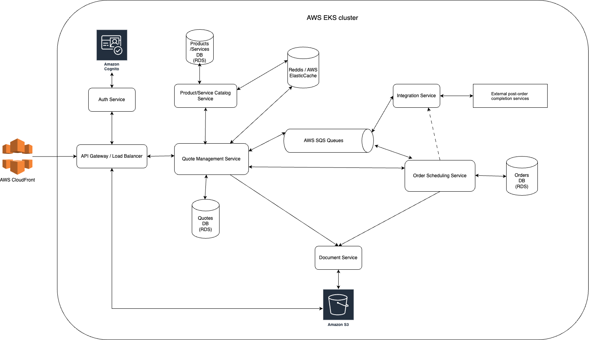

# Quote Management

High-Level architecture 

## Service

Current repo implements `Products Service`.

OpenAPI spec for the implemented API could be found in [docs folder](docs/swagger.yaml).

Products service implements CRUD operations for product entity.

## Setup
Docker is required to run current setup

1. Git clone
2. Create local copy of `.env.template` and with `.env` name
3. Run `docker-compose up`
